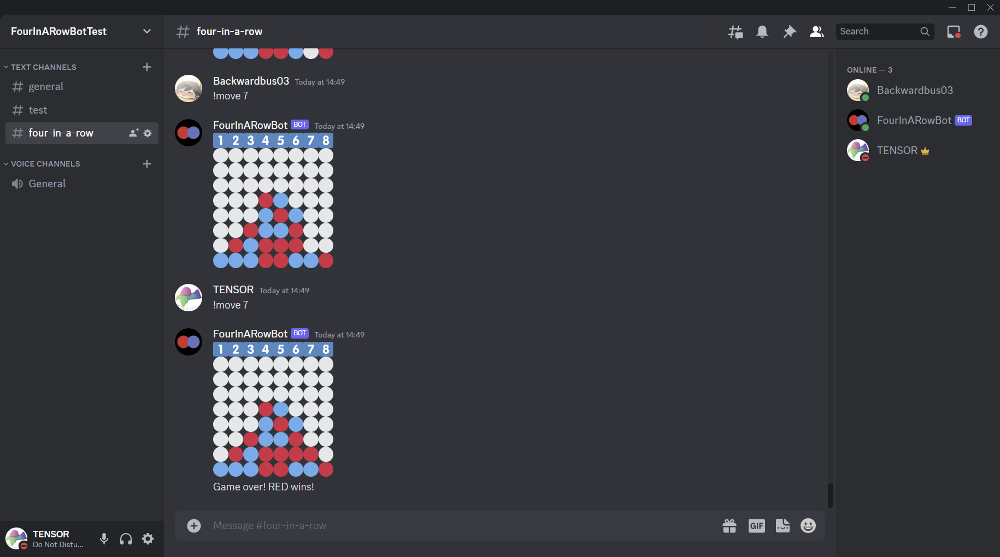

# Four in a Row Bot

This project is a Discord bot that lets Discord users play the popular two-player game 
Four in a Row (called Connect Four by Hasbro) against each other. The project has two parts—the code for the bot written using the discord.py library (in the [bot](/bot) directory and a backend API written using Flask (in the [server](/server) directory). The Flask backend interacts with a MongoDB database storing game data. The bot uses the API to save completed games and retrieve player stats. 

## Features

### Bot

* The bot supports multiple simultaneous games across different servers and channels. However, 
only one game can be played at a time in a single channel.
* The standard Four in a Row board has 6 rows and 7 columns. Games are won by achieving 4 pieces in a row. The bot 
  supports games with custom board sizes (users can specify the number of rows and columns they want when creating  a new game).
  Users can also specify a custom number of pieces in a row to win the game.
* By default, the bot randomly chooses which players starts first, but there is also support for the player 
  initiating the game to chose whether they want to start first or second.
* A player can resign a game at any time. This will end the game and give the win to the other player.
* The bot detects and correctly handles invalid moves (such as a move by a player when it's not their turn, a move 
  in a column that's full, a move by a user who's not a participant in an active game)
* The saves each game to after it has completed by making requests to the backend API. 
* The bot allows users to view their stats (the number of games they have won, lost, and drawn. 

### Backend 
* The backend exposes an API method to save games to a MongoDB database. The backend supports storing the Discord User IDs of the two players who played the game, the IDs of the server and channel in which the game was played, the board configuration for the game (number of rows, columns, and pieces in a row to win), the moves played in the game, the result of the game, and the date and time when the game was completed.
* The backend exposes an API method to retrieve stats for any user. Stats consist of the number of games the user has won, lost and drawn. Stats can also be queried for games played against a particular opponent, in a particular server or channel, and in a particular date and time range.
* To protect user data, the backend is secured using an API key that must be sent as an authorization header with every request. A hashed version of the API key is stored on the MongoDB database. If you want to host this bot yourself, you will have to generate an API key and store it in the database manually (see the [Self-hosting instructions](#self-hosting-instructions) section for more information).

## Self-hosting instructions

To run this bot, you will have to host it yourself. This will involve individually hosting the bot and the Flask backend application. The bot can, however, run without the Flask backend; it will simply lack the ability to save completed games and display user stats. 

### A) Installing and running the bot without the backend

* Clone this repository: `git clone https://github.com/NikhilSDate/FourInARowBot.git`
* Navigate to the `bot` directory. This is where the code for the bot is located
* Install the requirements: `pip install -r requirements.txt`
* Create a file with the name `.env` in the `bot` directory. Paste the following line into this file:
  ```
  DISCORD_TOKEN=<your_discord_token>
  ```
* Run the `main.py` script with `python main.py`. The bot should now be up and running.
  

### B) Running the backend 
Note: these instructions are for running the backend locally. If you want to run the backend on a cloud platform like Render or Vercel, you might have to manually add the `DB_URI` emvironment variable instead of using a `env` file. See the instructions below for the value of this environment variable.

* Create a MongoDB database (either locally or in the cloud) to store game data. The backend will will store game data in a collection named `games` in this database. If you use MongoDB Atlas for this step, you will have to add the public IP address of the Flask backend to the IP Access List of the MongoDB Atlas project containing your database. 
* Navigate to the server directory
* Navigate to the `server` directory and create a file with the name `.env`. Paste the following line into this file (note that the connection string should have the database name at its end):
  ```
  DB_URI=<your_monngodb_connection_string>
  ```
* The Flask application is contained in the `app.py` file in the `server` directory. You can run the application locally using Flask's development server using the following command from the `server` directory:
  ```
  flask run --cert=adhoc
  ```
  This runs the aplication over HTTPS using a self-signed certificate. HTTPS is needed since the application receives an API key and sends and receives Discord User IDs, which should both be encrypted.
* The Flask backend should be up and running. However, the bot won't be able to talk to the application just yet. The next sections explains how to integrate the bot with the backend 

### C) Integrating the bot and the backend
* Generate an API key using a method of your choice. Use Python's `hashlib` module to hash the key using SHA256 as follows (where `key` is your API key and should be a string):
  ```python
  hashed_key = hashlib.sha256(key.enocode('utf-8')).hexdigest()
  ```
* Create a collection named `api_keys` in your database and insert the following document into it:
  ```javascript
  {
    key: "<your hashed key>"
  } 
  ```
  MongoDB should generate an `_id` field for this document automatically.
* Navigate to the `bot` directory.
* In the `.env` file you created in part A in the `bot` directory, add the following line:
  ```
  DATA_API_KEY=<your-unhashed-api-key>
  ```
  Make sure that you add the **unhashed** API key.
*  Open the `config.json` file in the bot directory and enter the following text:
  ```javascript
  {
    "DATA_API_URL": "<url_of_the_flask_backend>",
  }
  ```
* Stop the `main.py` script if it is still running from when you ran it in Part A and run it again with `python main.py`. The bot should now be able to talk to the API.
  
## Video demo

https://github.com/NikhilSDate/FourInARowBot/assets/47920034/8dfe280b-bb10-4135-884b-9693179681fe

## Screenshots

### A user initiating a game


### A game in progress


### A player resigning a game


### Viewing stats with and without filters


### A game with a custom board size (8 rows and 8 columns)



### A player initiating a game and choosing to start second


